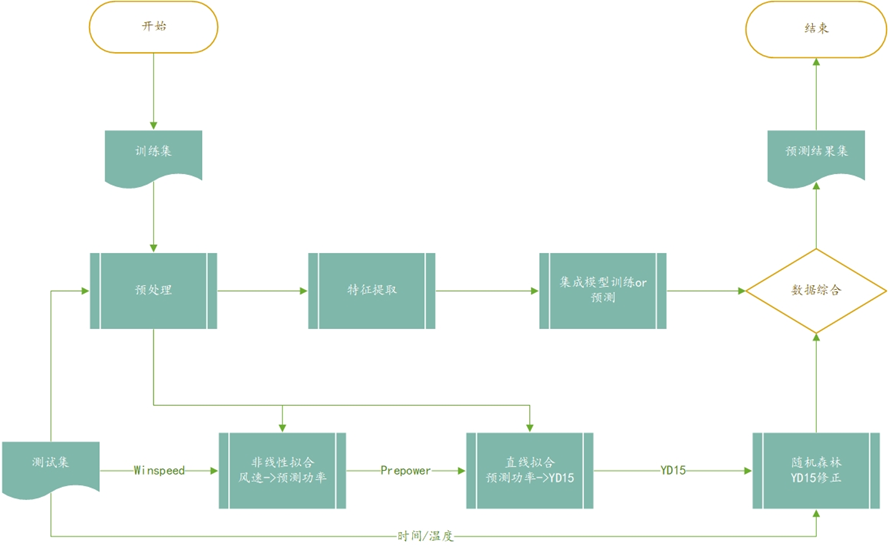
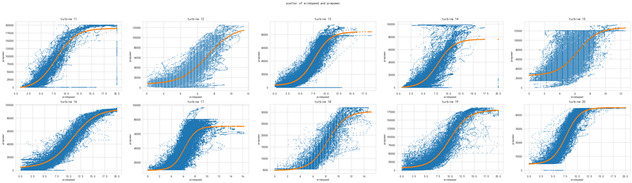

# 开发手册

这部分将详细介绍本软件使用的开源工具和项目架构。

## 软件设计

### 前端设计

### 后端设计

#### 框架选择

Flask 是使用 Python 编写的 Web 微框架，核心简单易于扩展。Flask 有两个主要依赖，一个是 WSGI（Web Server Gateway Interface，Web 服务器网关接口）工具集——[Werkzeug](https://werkzeug.palletsprojects.com/en/2.3.x/)，另一个是 Jinja2 模板引擎。软件采用前后端分离的架构，因此仅使用了前者的部分功能。

#### 数据库设计

为了便于开发和测试，软件选用 SQLite 作为数据库管理系统（DBMS，Database Managerment System）。考虑到在 Web 应用里使用原生 SQL 语句操作数据库存在如下问题：

1. 手动编写 SQL 语句比较繁琐，且视图函数中引入过多 SQL 语句会降低代码可读性。此外还容易出现安全问题，如 SQL 注入。
2. 常见的开发模式是在开发时使用简单的 SQLite，而在部署时切换到 MySQL 等更健壮的 DBMS。但是对于不同的 DBMS，我们需要使用不同的 Python 接口库，这让 DBMS 的切换变得不太容易。

使用 ORM 可以很大程度上解决这些问题。它会自动帮助你处理查询参数的转义，尽可能地避免 SQL 注入的发生。另外，它为不同的 DBMS 提供统一的接口，让切换工作变得非常简单。ORM 扮演翻译的角色，能够将 Python 语言转换为 SQL 指令，方便开发者使用 Python 来操控数据库。项目中为此引入了 Flask-SQLalchemy 扩展，简化连接数据库服务器、管理数据库操作会话等各类工作，让 Flask 中的数据处理体验变得更加轻松。

数据库表项主要设计了两个对象：用户和模型。为保持简洁，没有过多设计二者之间的关联。

## 算法设计

### 流程概述

算法设计简要流程图如下：

### 数据处理

* 数据剪裁：传入dataframe后，进行去重/去头/去中/去尾等剪裁操作，使其变为window_size的整数倍，且更加符合模型特征规律。
* 非线性自定义拟合：选取“在合理范围内”的预测风速——预测功率数据对，利用curve_fit构建自定义函数
  L/(1+e^(-k∗(x-x_0)) )+b 进行拟合，得到风速——功率修正S型曲线，后续将对曲线进行修正。

* 线性拟合：选取“在合理范围内”的PREPOWER——YD15数据对，利用最小二乘法得到PREPOWER——YD15拟合直线。
* 数据补全：对ROUND(A.WS,1)、ROUND(A.POWER,0)、YD15为空值的情况，依据上述拟合公式，进行数据补全。

* 数据清洗：经过上述流程已经得到了完整数据，对离群值、长时间不动值等异常数据进行清洗，并通过上述两个拟合曲线进行修正。
* 特殊事项：目标场景往往有特殊情况，如风速过大风机停转保护、功率较低时厂区耗电、风扇转向等。

### 模型设计

#### 框架选择

主模型为PaddleTS库中的改进的LSTM时序模型。

副模型为Transformer模型。

#### 具体实现

多次调整参数，经典的LSTM始终没有很好的效果，原因是数据随时间变化的规律性较弱，即纵向预测较难。

考虑通过调整模型的sampling_stride、in_chunk_len、out_chunk_len大小，利用同一时期的数据进行横向预测。令移进步长sampling_stride为4，in_chunk_len=out_chunk_len=windowsize。同时对数据的时间和后三列进行移位，增加特征提取，进行同一时间段的预测。

兵将Dataframe的后三列和时间向后移一个windowsize的长度（即172），同时提取功率的滚动插值和平均值等特征。
