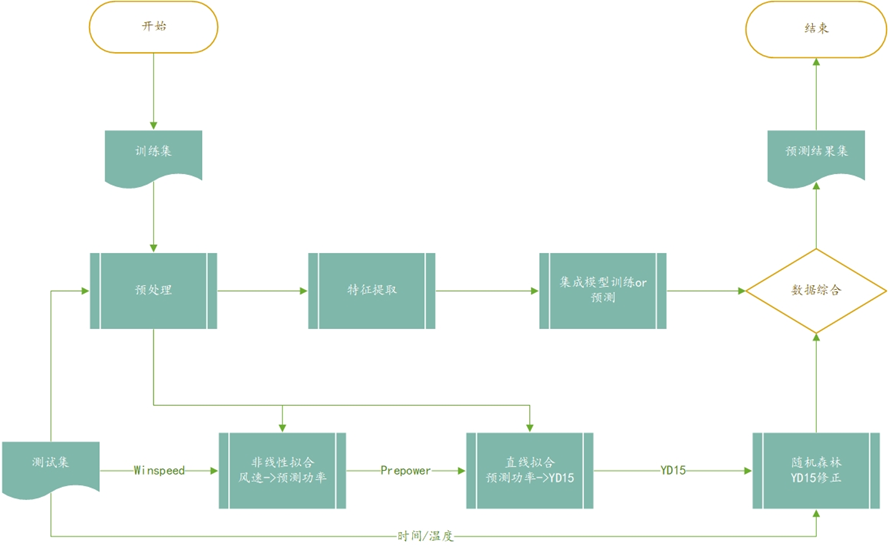

# 开发手册

这部分将详细介绍本软件使用的开源工具和项目架构。

## 软件设计

### 前端设计

前端项目部分围绕 React 18 + Typescript 为核心进行构建：

- 组件化方面全部使用函数式组件和Hook语法
- 完全利用 Typescript 进行静态类型检查，项目中没有 `any` 的出现
- 根据后端接口规范文档做了相应的 `.d.ts` 类型声明

#### 架构设计

从实际使用场景考虑，本应用使用 SPA+CSR（客户端渲染单页面Web应用）实现，并未使用 SSR。

使用 `react-router` 的 `BrowserRouter` 实现前端页面路由系统，赋予多页面交互功能。

##### 页面和组件树

- 全局共用一个 Layout，负责管理全局公共状态如登录状态等

- 根据用户场景划分 Pages
  - Main 为主页，负责模型运行场景
  - Train 为新建模型页面，负责模型训练场景
- 根据数据流和交互逻辑对组件进行抽象
  - 通用组件（General）：一般不实现特定逻辑，作为基础组件被其他组件调用，如`Collpase`, `Modal`, `Switch` 等
  - 功能组件：由基础组件和业务逻辑（自定义Hook抽象实现）封装而成，一般只有会复用的功能才会抽象成独立组件，如`FileManager`, `TaskManager`等组件在模型运行和训练过程中可以复用
  - 组合组件：对组件进行简单组合，这一步一般放在 Pages 中进行

##### 状态管理

本应用使用局部状态提升+全局状态的架构。

- 全局状态使用现代的 `zustand` 库管理，其提供 Hook 风格的 API 和易用 Selector 优化
  - 登录状态
  - 全局数据集（用于渲染图表）
- 其他时候**尽量使用本地状态**，需要共享的状态就近提升到最近的公共父节点中

##### 项目架构

项目中尽可能使用现代化的工具链：

- 包管理器：使用 pnpm 替代 npm 进行依赖管理
- 开发工具：使用 Vite 以提供更快的 HMR
- 构建工具：使用 Vite 内建的 ESBuild + SWC 进行 TypeScript 编译和生成目标代码
- 项目管理：使用 lint-staged 和 commit-lint 规范代码提交
- 项目样式：在 Joy UI 和 emotion 引擎的基础上构建了自定义组件

#### 组件设计

本应用编写过程中遵循**最少CSS编写**原则，使用原子化、CSS-in-JS等手段减少CSS的代码数量。

- 整个项目仅包含一个 `index.css` 文件来编写最基础的 CSS
  - 全局基础属性
  - 基于媒体查询的响应式CSS变化
  - 原生CSS变量定义
- 在Joy UI提供的组件基础上使用emotion提供的CSS-in-JS渲染引擎进行自定义组件封装，避免书写重复组件样式和基础逻辑
- 大量使用自定义Hook进行抽象，减少了组件内部逻辑的复杂度，增强了项目的可维护性

#### WebSocket 实现

本项目使用 `socket.io` 作为 WebSocket 协议的提供者，其具有可靠性交付、跨平台、命名信道等良好特征，适合本项目多模型运行会话的需求。

本项目在WebSocket协议的基础上定义了一套自己的事件系统，客户端和服务端通过这套事件系统进行全双工的实时通信，获取对方的实时状态，使我们支持：

- 实时获取模型运行进度和日志信息
- 全自动化的滚动预测

#### 可视化交互实现

本应用的可视化部分由 `echarts` 作为底层实现。

ECharts 是一款开源的功能强大且灵活的数据可视化库。它是基于HTML5 Canvas技术的图表库，用于创建各种类型的交互式图表和数据可视化。

ECharts提供了丰富的图表类型，包括折线图、柱状图、饼图、散点图、雷达图、热力图等，以及地图和3D图表的支持。无论是简单的数据可视化还是复杂的仪表盘和大屏展示，ECharts都能满足各种数据展示需求。

在 echarts 的基础上，本应用实现了：

- Hook化的调用封装
- 全自动数据更新
- 可交互的图表设计
- 响应式缩放图表
- 预测数据高亮显示

### 后端设计

#### 框架选择

Flask 是使用 Python 编写的 Web 微框架，核心简单易于扩展。Flask 有两个主要依赖，一个是 WSGI（Web Server Gateway Interface，Web 服务器网关接口）工具集——[Werkzeug](https://werkzeug.palletsprojects.com/en/2.3.x/)，另一个是 Jinja2 模板引擎。软件采用前后端分离的架构，因此仅使用了前者的部分功能。

#### 数据库设计

为了便于开发和测试，软件选用 SQLite 作为数据库管理系统（DBMS，Database Managerment System）。考虑到在 Web 应用里使用原生 SQL 语句操作数据库存在如下问题：

1. 手动编写 SQL 语句比较繁琐，且视图函数中引入过多 SQL 语句会降低代码可读性。此外还容易出现安全问题，如 SQL 注入。
2. 常见的开发模式是在开发时使用简单的 SQLite，而在部署时切换到 MySQL 等更健壮的 DBMS。但是对于不同的 DBMS，我们需要使用不同的 Python 接口库，这让 DBMS 的切换变得不太容易。

使用 ORM 可以很大程度上解决这些问题。它会自动帮助你处理查询参数的转义，尽可能地避免 SQL 注入的发生。另外，它为不同的 DBMS 提供统一的接口，让切换工作变得非常简单。ORM 扮演翻译的角色，能够将 Python 语言转换为 SQL 指令，方便开发者使用 Python 来操控数据库。项目中为此引入了 Flask-SQLalchemy 扩展，简化连接数据库服务器、管理数据库操作会话等各类工作，让 Flask 中的数据处理体验变得更加轻松。

数据库表项主要设计了两个对象：**用户 User** 和**模型 PaddleModel**。为保持简洁，没有过多设计二者之间的关联。

## 算法设计

### 流程概述

算法设计简要流程图如下：

### 数据处理

- 数据剪裁：传入 dataframe 后，进行去重/去头/去中/去尾等剪裁操作，使其变为窗口的整数倍，且更加符合模型特征规律。
- 非线性自定义拟合：选取“在合理范围内”的预测风速——预测功率数据对，利用 curve_fit 构建自定义函数
  $\frac{L}{1 + e^{-k * (x - x_0)} + b}$ 进行拟合，得到风速——功率修正 S 型曲线，后续将对曲线进行修正。

- 线性拟合：选取“在合理范围内”的 `PREPOWER`——`YD15` 数据对，利用最小二乘法得到 `PREPOWER`——`YD15` 拟合直线。
- 数据补全：对 `ROUND(A.WS,1)`、`ROUND(A.POWER,0)`、`YD15` 为空值的情况，依据上述拟合公式，进行数据补全。

- 数据清洗：经过上述流程已经得到了完整数据，对离群值、长时间不动值等异常数据进行清洗，并通过上述两个拟合曲线进行修正。
- 特殊事项：目标场景往往有特殊情况，如风速过大风机停转保护、功率较低时厂区耗电、风扇转向等。

### 模型设计

#### 模型选择

采用 PaddleTS 的集成预测器 StackingEnsembleForecaster，主模型为 [LSTNet 模型](https://github.com/PaddlePaddle/PaddleTS/blob/main/paddlets/models/forecasting/dl/lstnet.py)，副模型为 [Transformer 模型](https://github.com/PaddlePaddle/PaddleTS/blob/main/paddlets/models/forecasting/dl/transformer.py)。

#### 具体实现

经过多次参数调整，经典 LSTM 始终没有很好的效果，主要原因是数据随时间变化的规律性较弱，即纵向预测较难，并且提供的数据量较小，难以通过加深网络层数的方式提高准确率。

考虑通过调整模型的 `sampling_stride`、`in_chunk_len`、`out_chunk_len` 大小，利用同一时期的数据进行横向预测。令移进步长 `sampling_stride` 为 4，`in_chunk_len` = `out_chunk_len` = `windowsize`。同时对数据的时间和后三列进行移位，增加特征提取部分，进行同一时间段的预测。并将 Dataframe 的后三列和时间列向后移一个 `window_size` 的长度，同时提取功率的滚动插值和平均值等特征。
