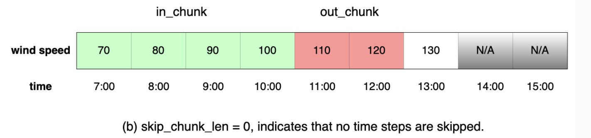

# 用户指南

!!! note "注意"

    平台的所有功能必须登录后才能使用！

## 使用模型

平台预先在模型库中提供了多种模型供用户自主选择。可供选择的模型包括:

- LSTM 模型
- Transformer 模型
- LSTM + Transformer 集成模型
- lightgbm 机器学习模型（暂未上架）

在使用过程中，用户可以点开 `应用模型` 或 `训练模型` 按钮旁的 `运行日志`，查看后台的详细日志信息，时刻关注任务进度和完成状况。

（补充截图）

### 应用模型

上传数据文件后，点击 `应用模型` 按钮即可使用选中的模型对上传的数据文件进行预测。

（补充截图）

## 训练模型

如果希望从原始数据训练模型，请先选择 {++模型管理++} 卡片右上角的 `训练模型` 按钮，然后设置参数。

（补充截图）

### 参数设置

平台允许设置的参数包括：

- 模型名称: 新模型的名称
- 训练轮次: 对应 `epochs`，即最大迭代次数
- 每轮训练集大小: 对应 `batch_size`
- 学习率: 对应 `learning_rate`
- 输入窗口大小: 对应 `in_chunk_len`
- 输出窗口大小: 对应 `out_chunk_len`

窗口大小的含义如下图所示。

软件使用 PaddleTS 自动划分数据集，用户无需手动构建，只需要上传数据文件即可。

!!! tip

    不建议将**输入窗口**设置得太小，这样模型无法学习到足够的特征，预测效果可能不理想。

### 开始训练

上传数据集并设定好训练参数后，点击 `训练模型` 按钮即可开始训练模型。
